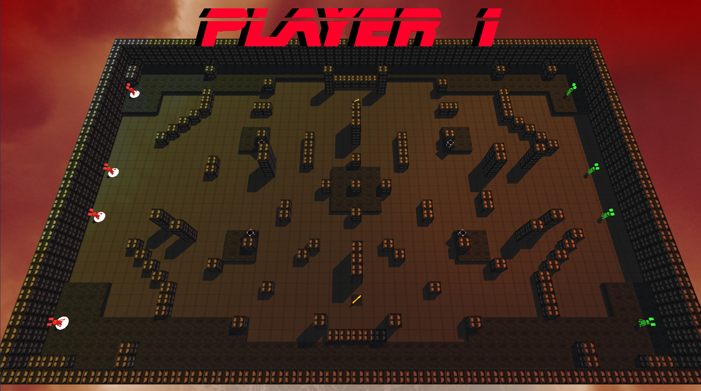

    

            
            <a href="./projects.html">Projects</a>
            <a href="./experience.html">Experience</a>
            <a href="./contact.html">Contact</a>
    

# <a href="./projects/robo_revolution.html">Robo Revolution</a>

    

## Overview
A unique mix of first person shooting and turn based tactics. Robo Revolution was developed during my time at California Polytechnic State University San Luis Obispo for CSC 476 Real-time Computer Graphics Software. I led the development of the game with a team of three other developers. 
## Features & Gameplay
Robo Revolution is a competitve game where two players go head to head controlling opposite teams. The game is intended to be played on one computer where players trade off taking turns. During a players turn they may select from one of their active robots. The selection process happens in an overhead view highlighting the controllable robots as well as giving both players an overview of the map so they can plan their next move. Once a player has selected a robot from the overhead view the camera pans down to the selected unit where the player posses the unit and enters a first person view. 

    <video class="img-body" autoplay loop muted>
        <source src=".././assets/media/robo_revolution_character_select.mp4" type="video/mp4">
    </video>
    
Selecting an available unit

During a players turn they may select from one of their inactive robots.
### Map Editor
## Technology
- C++
- OpenGL
### Character Selection and Animated Camera
This page is under construction 

# University Senior Project
This page is under construction 

# Game Jam Game
This page is under construction 

# Team 3 Game
This page is under construction 

# Airplane Animation
This page is under construction 

# Turn Based Animation Final Game
This page is under construction 

 

<!-- This button is having some strange behavior currently -->
<!-- <button id="scrollToTopButton" class="button-scroll" onclick="scrollToTop()">Scroll to Top</button> -->

<!-- Reference js script for scrolling -->

