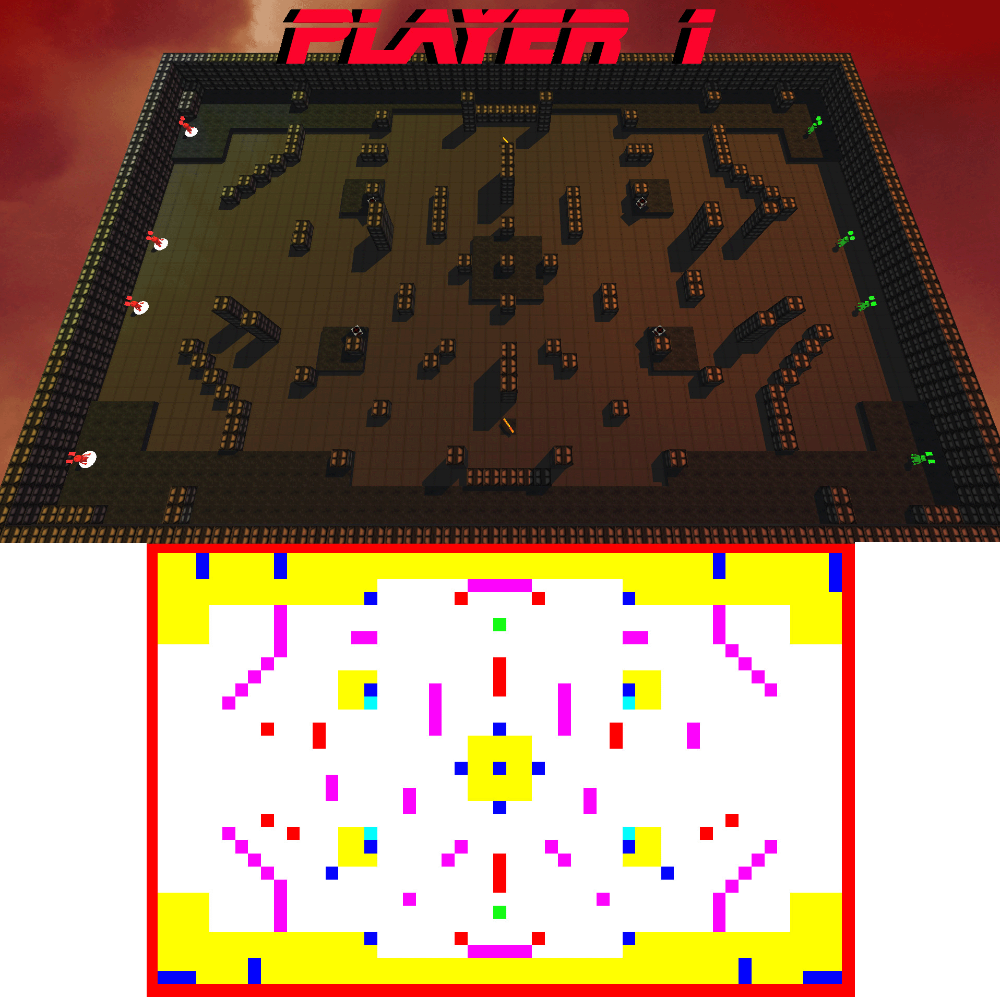
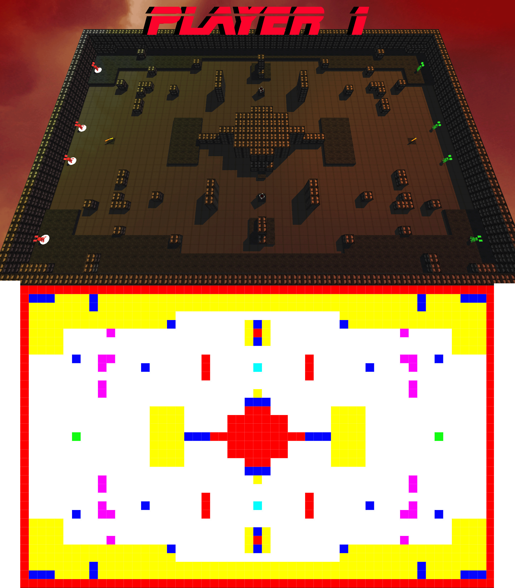

 
 

# Overview
A unique mix of first person shooting and turn based tactics. Robo Revolution was developed during my time at California Polytechnic State University San Luis Obispo for CSC 476 Real-time Computer Graphics Software. My role on the game was leading and manging a team of three other developes as well as assisting in game design and programming. 

    <video class="img-body" controls loop muted>
        <source src="../../assets/media/robo_revolution_teaser.mp4" type="video/mp4">
    </video>

# Features & Gameplay
Robo Revolution is a competitve game where two players go head to head controlling opposite teams. The game is intended to be played on one computer where players trade off taking turns. During a players turn they may select from one of their active robots. The selection process happens in an overhead view highlighting the controllable robots as well as giving both players an overview of the map so they can plan their next move. Once a player has selected a robot from the overhead view the camera pans down to the selected unit where the player posses the unit and enters a first person view. 

During a players turn they may select from one of their inactive robots.
## Animated Camera
To give the game a more dynamic feeling we wanted to show the view from panning the camera down from an overhead view to the possessed units perspective. This is acomplished by linearly interpolating the camera from the overhead view down into a first person view for the selected unit. Both unit selection and weapon firing relied upon accurately converting onscreen coordinates back into 3D world space to ensure accurate unit seletion and gun play. 

    <video class="img-body" controls loop muted>
        <source src="../../assets/media/robo_revolution_character_select.mp4" type="video/mp4">
    </video>
    
Selecting an available unit

The camera also animates when players fire a units weapon as the camera follows the projectiles across the map. 

## Map Editor
Early the development of Robo Revolution we wanted to have an easy to use, but powerful map editor that would allow us to create and prototype maps rapdily. Due to the simplistic cube like geometry used in our levels I decided to simply use a colored pixel grid to represent the map. 

    
    
The map we demoed our game with. The final product above and the .bmp used to generate it below.

With a .bmp repesentation of the map (like seen above) I created a parser to go through the images data and select the appropriate geomerty, weapon or item (based on a pixel's color) and transform it (based on a pixel's position) in the game world. With this process many maps could be created and tested quickly. 

    
    
Another map generated from .bmp image input.

## Visuals

## Collision Detection

# Technology
- C++
- OpenGL
### Character Selection and Animated Camera
This page is under construction 